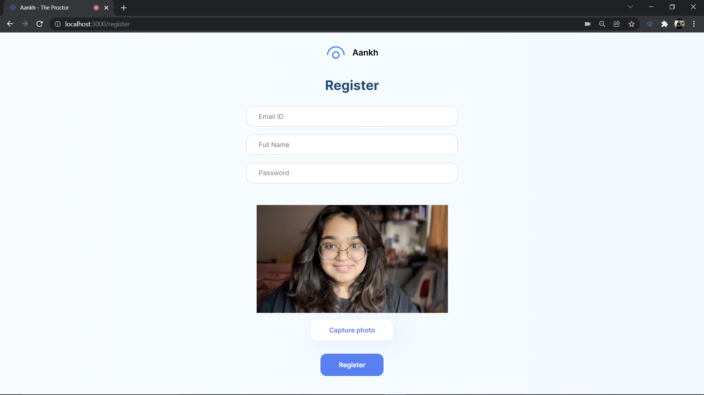

 

  

  A straightforward framework built for automatic proctoring to create online tests, <i>effortlessly</i>.
   
   
  <a href="#table-of-content"><b>Explore the docs »</b></a>
   
   
  <a href="#architecture-and-design">Architecture</a>
  &nbsp;&nbsp;·&nbsp;&nbsp;
  <a href="#demonstration">Features</a>
  &nbsp;&nbsp;·&nbsp;&nbsp;
  <a href="#contributing">Local Setup</a>
   

 
 

  

 

### Table Of Content

- [Architecture](#architecture-and-design)
- [Design](#design)
- [Demonstration & Features](#demonstration)
- [Technologies Used](#technologies-used)
- [Local Setup & Contributing](#contributing)
- [License](#license-)
- [Authors](#authors)

 

### Problem we are trying to solve?

Due to Covid-19, remote learning has been a constant and so have online examinations.  
But proctoring has always been a task and cheating and unfair practices have always been a problem.

**Problems with the existing system:**

The current solutions assume the presence of two platforms:  
- One for writing exams (like Google Forms)  
- And another (like Meet or Zoom) for manual proctoring

**MonitorPal** aims to replace the need for human invigilation by automatically monitoring student behavior during the test — no teacher needed.

### Market & User Research

- Existing tools are largely paid.
- Students find the UX of such platforms clunky.
- Educators often need to manually upload or format tests.
- No real-time admin dashboard or control panel is available.

That’s where **MonitorPal** steps in.  
A smart, intuitive, and unified platform.

 

## Architecture and Design

Hackathon tradeoff: `Speed over quality`  
But we’re proud to say we kept structure and best practices in mind:

- Architecture
- Design
- Code

[📊 Presentation for MonitorPal](https://docs.google.com/presentation/d/1h3WqCwEhf5xG7TsZ-yNuDoE9ybbFiaAMEsltQ3KrLEc/edit?usp=sharing)

### Architecture

- Built and visualized using [excalidraw](https://excalidraw.com)

 

 

### Design

- Designed in [Figma](figma.com)
- Developed using [React](https://beta.reactjs.org)  
[🎨 Figma Design Link](https://www.figma.com/file/pbuXQGcgFpsi2lgEbtllXf/aankh)

 
  
 

## Demonstration

### Landing Page

  
  
  

### Register & Login

<table>
  <tr>
    <td></td>
    <td></td>
  </tr>
  <tr>
    <td>User registers. Face verification kicks in once the exam begins.</td>
    <td>User login to access the test.</td>
  </tr>
</table>

### Create Test & Dashboard

<table>
  <tr>
    <td></td>
    <td></td>
  </tr>
  <tr>
    <

